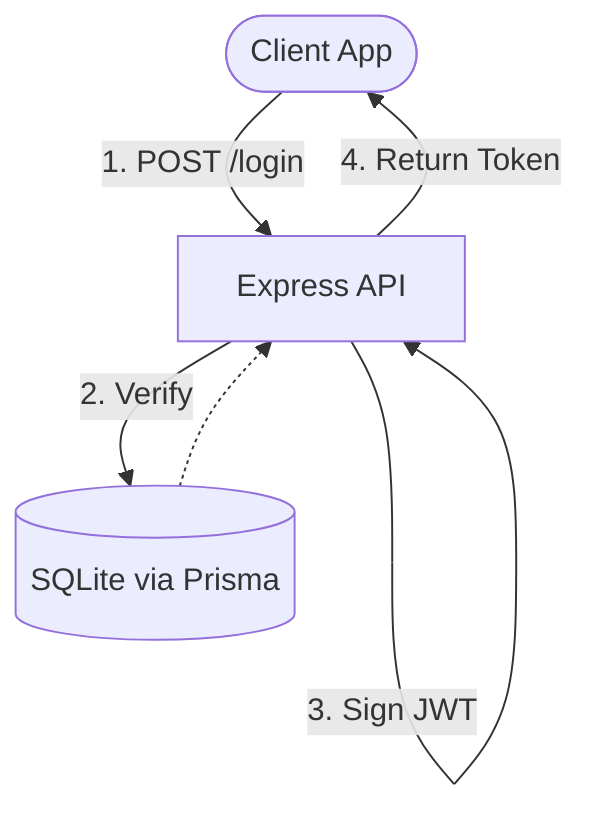

# Architecture — enterprise-iam-auth-poc-node
> Last updated: 2026-08-29 | Maturity: Deprecated
> _See Python version for canonical implementation._

## System Diagram


## Component Table
| Component | File | Responsibility | Tech |
|---|---|---|---|
| Routes | `src/routes/` | Express route definitions | Node.js |
| Auth Middleware | `src/middleware/auth.ts` | Token validation & RBAC | TypeScript |
| Database | `prisma/` | ORM schemas | Prisma |


## 🏗️ Domain-Driven Design (DDD) Modularity

The application uses an enterprise-standard `Controller-Service-Route` architecture.

```text
src/
├── controllers/    # Handles HTTP requests/responses (e.g. auth.controller.ts)
├── middleware/     # Express middleware for Auth & RBAC (e.g. auth.middleware.ts)
├── routes/         # Express Router definitions
├── services/       # Core business logic and database interactions
├── utils/          # Helper functions (hashing, JWT)
├── app.ts          # Express application configuration
└── index.ts        # Server entry point
```

## 🔐 Security Deep Dive

### 1. Prisma ORM
We chose Prisma for the database layer because it offers superior type safety in TypeScript compared to older ORMs like TypeORM or Sequelize. It prevents SQL injection inherently and provides a clean schema definition (`prisma/schema.prisma`).

### 2. Role-Based Access Control (RBAC) Middleware
We implemented a custom Express middleware flow:
1. `requireAuth`: Verifies the JWT and attaches the decoded payload to the `Request` object.
2. `requireRoles(['admin'])`: Intercepts the request, checks the attached user payload against the required roles, and returns `403 Forbidden` if they lack permissions.

### 3. Password Hashing
We utilize `bcryptjs` with a secure salt rounds configuration. Hashing occurs in the `AuthService` before data reaches the Prisma client.